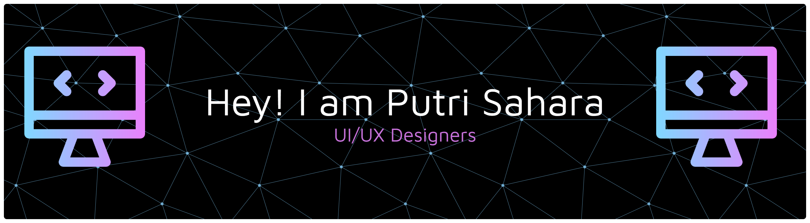

## Hi there, I'm Putri Sahara 👋

### 👩‍💻 About Me

I am an Information Technology student at Universitas Sumatera Utara who is passionate about Web Development and Artificial Intelligence. 
I enjoy building clean, responsive, and user-friendly web applications.

### 🌐 Connect With Me

### 🛠 Tech Stack
#### 💻 Programming Languages

  

#### ⚙️ Frameworks & Libraries

  

#### 🛠 Tools

  

#### 🗄 Database

    

#### 💻 Operating System

  

### 📊 GitHub Stats

  

#### My Motivation
✨ *“Consistency beats motivation.”*

